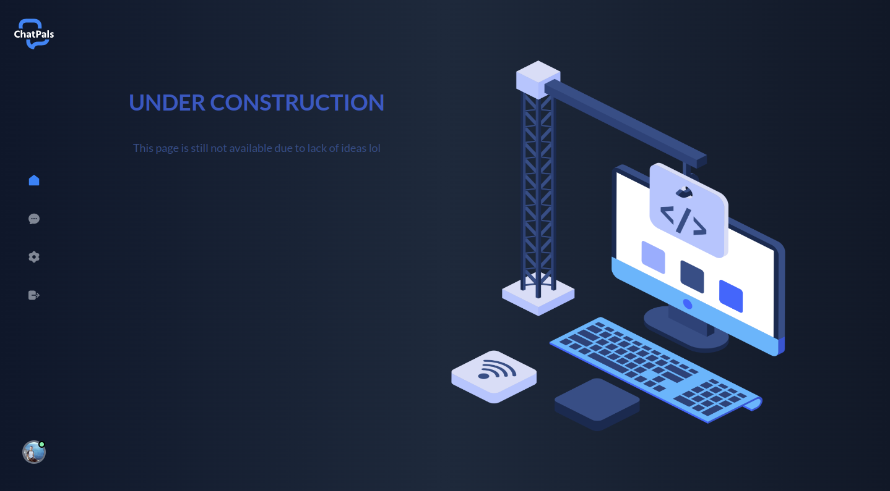
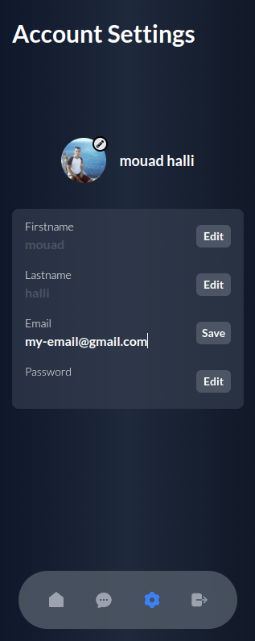
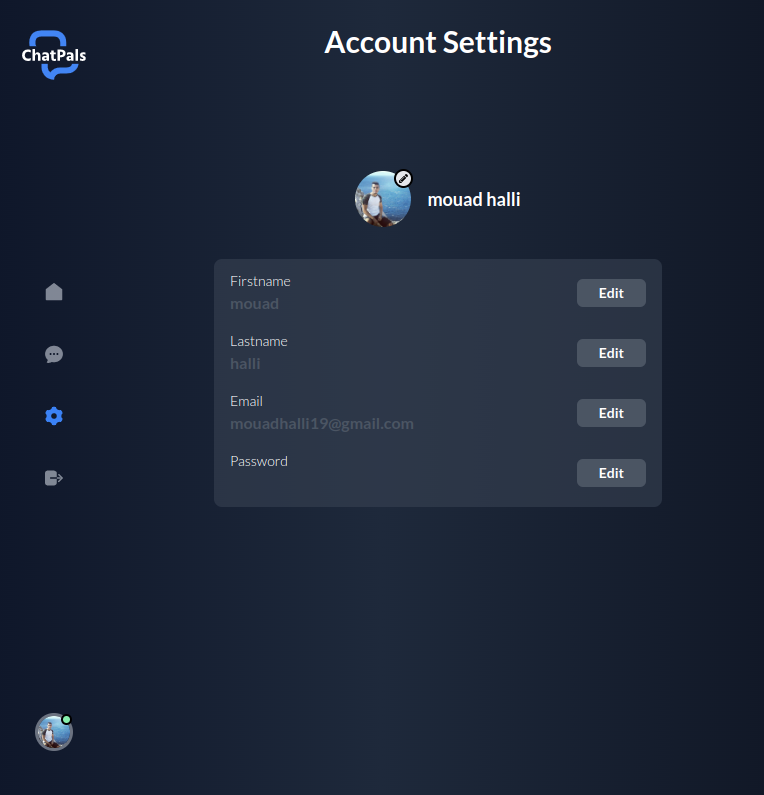

<h1 align="center">ChatPals</h1>

<h3 align="center">It's a MERN Stack Single-Page Chat Web-Application</h3>

<h2 align="center">🖥️ Tech Stack</h2>

<h4 align="center">Frontend:</h4>

  
  
  

<h4 align="center">Backend:</h4>

  
  
  
  

## Sections
The Web-App contains 3 main sections: **Authentication**, **Settings**, **Home(Under-Construction)**, **Chat** and **Channel**.

 

### Authentication
#### You can Authenticate safely with you google account or create an account manually, you can always hide or show you password.
<table>
  <tr>
    <td></td>
    <td align="center"></td>
  </tr>
<!--   <tr>
    <td></td>
    <td></td>
  <tr/> -->
  <tr>
    <td></td>
    <td align="center"></td>
  </tr>
</table>

### Home
#### The Home section is currently under construction, if you have any ideas for this section you can contact me, maybe we will work together <3
<table>
  <tr>
    <td></td>
  </tr>
</table>

### Settings
#### In this Section you can upload your image or update your data, you can click the edit button to unlock the field you want to update then save.
<table>
  <tr>
    <td></td>
    <td></td>
  </tr>
<!--   <tr>
    <td></td>
  </tr> -->
</table>

### Chat - This Section contain the Chat-Nav && Chat-List
####  - In the Chat-List you can find all you chat Channels

<table>
  <tr>
    <td></td>
  </tr>
</table>

####  - In the Chat-Nav you can search for friends, send friend requests, receive friend requests, remove users from friend list, (Real-time).

<table>
  <tr>
    <td></td>
    <td></td>
    <td></td>
  </tr>
</table>
  
### Channel
#### You can send and receive messages with real-time comunnication, you can also use emojis.
  
<table>
  <tr>
    <td></td>
    <td></td>
  </tr>
</table
  
